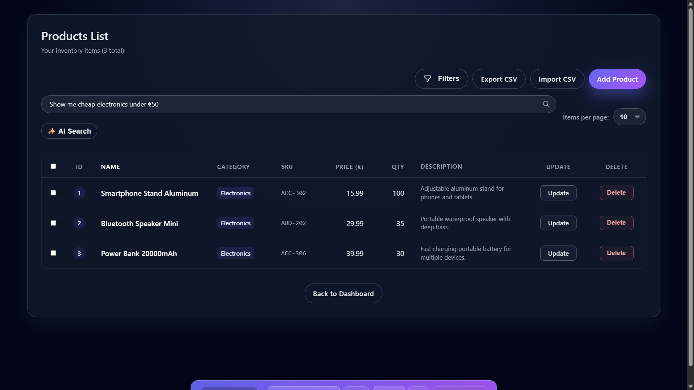
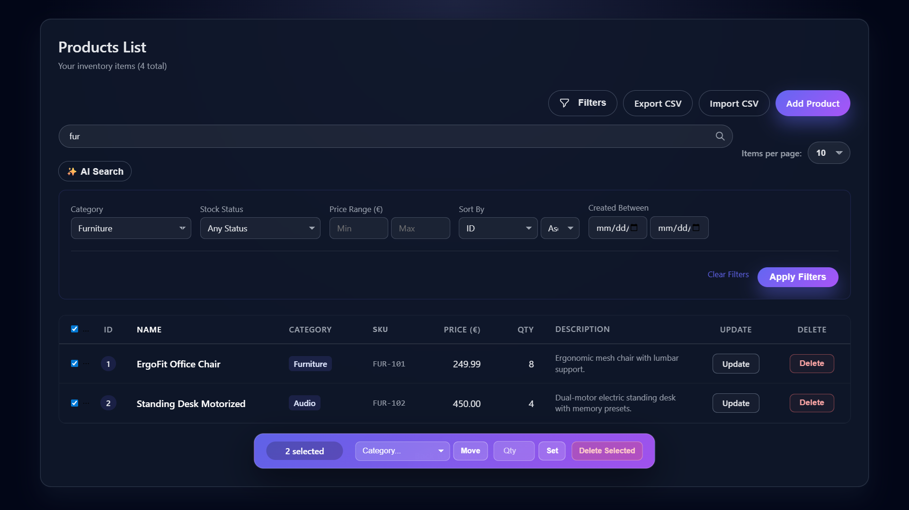
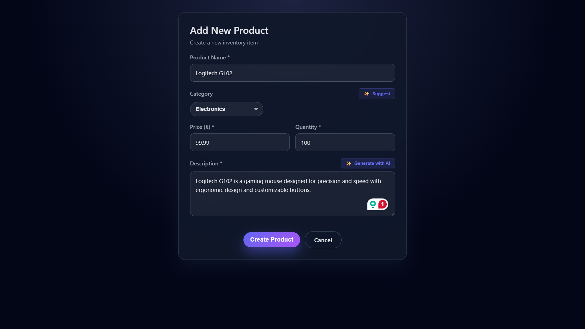
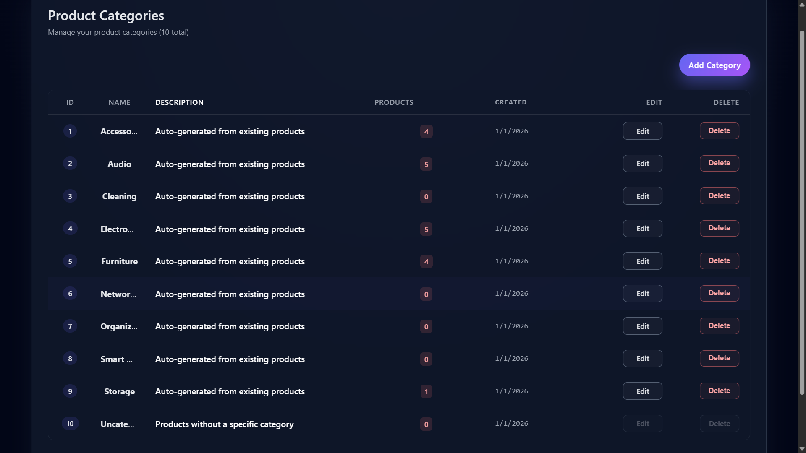
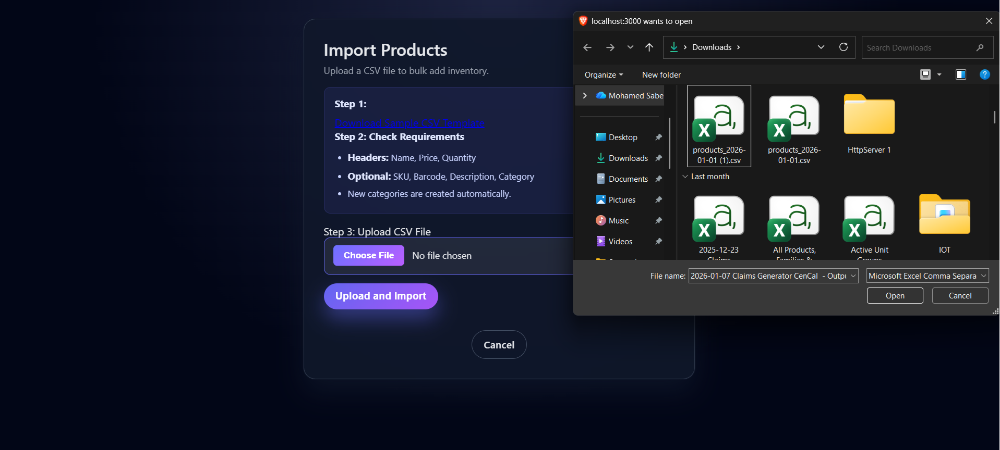
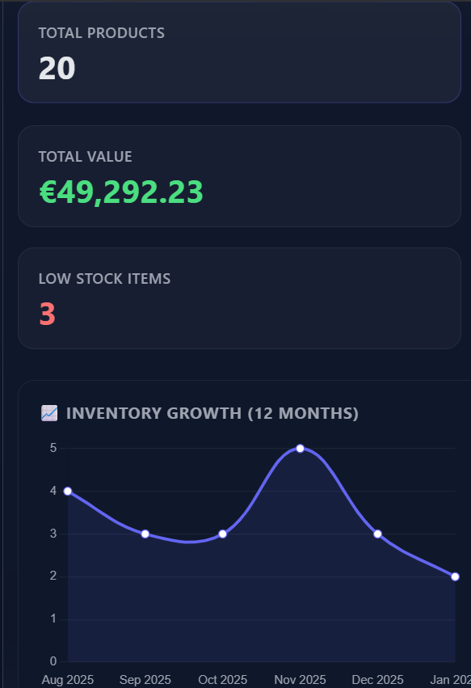
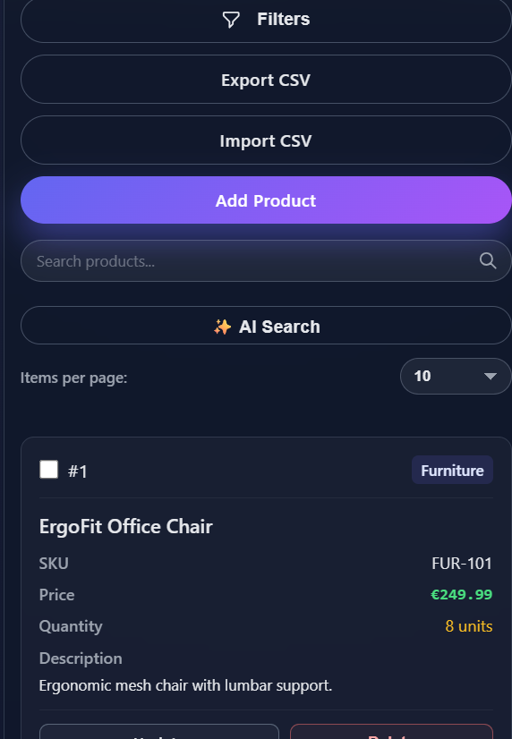

# 📦 AI-Powered Inventory Management System

A professional, full-stack inventory management suite featuring automated stock tracking, bulk operations, and advanced AI integrations for business insights.


---

## 📸 Screenshots

### Dashboard Overview


_Main dashboard with real-time statistics, charts, and activity feed_

### AI-Powered Smart Search


_Natural language search: "Show me cheap electronics under €50"_

### Product Management


_Advanced filtering, search, and bulk operations_

### AI Description Generator


_Automatic product description generation based on name and category_

### Category Management


_Organize inventory with custom categories_

### Data Import/Export


_Bulk import via CSV and database backup_

### Mobile Responsive

<div align="center">
  
  
</div>

_Fully responsive design for mobile and tablet devices_

---

## 🚀 Features

### 🧠 AI Integration (Groq/OpenAI)

- **Smart Search**: Uses Natural Language Processing (NLP) to convert queries like _"Show me cheap electronics under €50"_ into filtered results.
- **Auto-Descriptions**: Generates factual product descriptions based on name and category.
- **Category Suggestions**: Analyzes product names to suggest the best matching category.
- **Dashboard Insights**: Provides an "Executive Summary" of financial health and stock risks.

### 🛠 Core Functionality

- **Complete CRUD**: Manage Products and Categories with a responsive UI.
- **Bulk Operations**: Multi-select actions for deletion, quantity updates, and category reassignment.
- **Stock Alerts**: Visual indicators and filters for "Low Stock" and "Out of Stock" items.
- **Data Portability**:
  - Export inventory to CSV
  - Bulk import products via CSV template
  - One-click SQL Database backup

### 🔒 Security & Performance

- **Authentication**: JWT-based sessions with httpOnly cookies and "Remember Me" functionality.
- **Protection**: Double CSRF protection, BCrypt password hashing, and Express-Rate-Limit for brute-force prevention.
- **Validation**: Strict schema validation using `express-validator`.
- **Search**: PostgreSQL GIN indexes for high-performance full-text searching.

---

## 🛠 Tech Stack

| Layer               | Technology                                           |
| ------------------- | ---------------------------------------------------- |
| **Backend**         | Node.js (Express 5.x)                                |
| **Database**        | PostgreSQL with pg Pool                              |
| **Frontend**        | EJS Templates, Vanilla JS, Chart.js                  |
| **Styles**          | Custom CSS3 (Mobile-first, Responsive)               |
| **AI Engine**       | Groq API (LLaMA 3.1/3.3 Models) via OpenAI SDK       |
| **Security**        | JWT, BCrypt, CSRF (csrf-csrf), Helmet, Rate Limiting |
| **Validation**      | Express Validator                                    |
| **File Processing** | Multer, PapaParse, json2csv                          |

---

## 📋 Prerequisites

Before you begin, ensure you have the following installed:

- **Node.js** (v18 or higher)
- **PostgreSQL** (v14 or higher)
- **Groq API Key** (or OpenAI compatible provider)

---

## ⚙️ Installation & Setup

### 1. Clone the repository

```bash
git clone https://github.com/MuhamedSaber1990/inventory-management-application.git
cd inventory-management-application
```

### 2. Install dependencies

```bash
npm install
```

### 3. Environment Configuration

Create a `.env` file in the root directory:

```env
# Server Configuration
PORT=3000
NODE_ENV=development

# Database Configuration
DB_USER=your_database_user
DB_HOST=localhost
DB_NAME=inventory_db
DB_PASSWORD=your_database_password
DB_PORT=5432

# Security Secrets
JWT_SECRET=your_strong_jwt_secret_key_here
CSRF_SECRET=your_strong_csrf_secret_key_here

# AI Configuration (Groq)
AI_API_KEY=your_groq_api_key_here

# Email Configuration (Mailtrap for development)
SMTP_HOST=smtp.mailtrap.io
SMTP_PORT=2525
SMTP_USER=your_mailtrap_user
SMTP_PASS=your_mailtrap_password
```

### 4. Database Initialization

Run the schema file to create all necessary tables:

```bash
psql -U your_user -d inventory_db -f schema.sql
```

Or manually run the SQL commands in your PostgreSQL terminal:

```sql
-- Create tables (Copy content from schema.sql)

-- IMPORTANT: The application requires this default category
INSERT INTO categories (name, description)
VALUES ('Uncategorized', 'Default fallback category')
ON CONFLICT (name) DO NOTHING;
```

### 5. Start the application

```bash
# Development mode
npm start

# Production mode (with PM2)
npm run prod
```

The application will be available at `http://localhost:3000`

---

## 📂 Project Structure

```
inventory-management-application/
├── public/                 # Static assets
│   ├── css/               # Stylesheets
│   ├── js/                # Client-side JavaScript
│   └── images/            # Images and icons
├── src/
│   ├── config/            # Configuration files
│   │   ├── database.js    # PostgreSQL Pool connection
│   │   └── csrf.js        # Double CSRF protection setup
│   ├── controllers/       # Business logic handlers
│   │   ├── aiController.js         # AI features (Groq API)
│   │   ├── authController.js       # Authentication & Dashboard
│   │   ├── productController.js    # Product CRUD
│   │   ├── categoryController.js   # Category management
│   │   └── exportImportController.js # CSV & Backup operations
│   ├── middleware/        # Express middleware
│   │   ├── auth.js                 # JWT verification
│   │   ├── roles.js                # Role-based access control
│   │   ├── authValidators.js       # Auth input validation
│   │   ├── productValidators.js    # Product validation
│   │   ├── categoryValidators.js   # Category validation
│   │   ├── rateLimiters.js         # Rate limiting
│   │   └── errorHandler.js         # Global error handling
│   ├── models/            # Database query functions
│   │   ├── productModel.js         # Product queries
│   │   ├── categoryModel.js        # Category queries
│   │   ├── userModel.js            # User & auth queries
│   │   └── analyticsModel.js       # Dashboard & charts
│   ├── routes/            # Route definitions
│   │   ├── index.js                # Main router
│   │   ├── authRoutes.js           # Auth endpoints
│   │   ├── productRoutes.js        # Product endpoints
│   │   ├── categoryRoutes.js       # Category endpoints
│   │   ├── exportImportRoutes.js   # Data management
│   │   └── apiRoutes.js            # AI API endpoints
│   └── utils/             # Utility functions
│       ├── mailer.js               # Nodemailer email service
│       ├── helpers.js              # SKU & barcode generators
│       └── passwordUtils.js        # Bcrypt & token utils
├── views/                 # EJS templates
│   ├── dashboard.ejs              # Main dashboard
│   ├── products.ejs               # Product listing
│   ├── addproduct.ejs             # Add product form
│   ├── editproduct.ejs            # Edit product form
│   ├── categories.ejs             # Category listing
│   ├── addcategory.ejs            # Add category form
│   ├── editcategory.ejs           # Edit category form
│   ├── import.ejs                 # CSV import page
│   ├── login.ejs                  # Login page
│   ├── signup.ejs                 # Signup page
│   ├── signup-success.ejs         # Post-signup message
│   ├── forgetpw.ejs               # Forgot password
│   ├── reset-password.ejs         # Reset password form
│   └── error.ejs                  # Error page template
├── screenshots/           # README screenshots
│   ├── dashboard.png
│   ├── products-list.png
│   ├── ai-search.png
│   ├── ai-description.png
│   ├── categories.png
│   ├── import-export.png
│   ├── mobile-dashboard.png
│   └── mobile-products.png
├── schema.sql             # Complete database schema
├── .env                   # Environment variables (not in repo)
├── .env.example           # Environment template
├── .gitignore             # Git ignore file
├── app.js                 # Application entry point
├── package.json           # Dependencies & scripts
└── README.md              # This file
```

---

## 🎯 Usage

### Default Login

After setup, create a user account through the signup page or manually insert a user into the database.

### AI Features

1. **Smart Search**: Navigate to Products → Use the search bar with natural language
   - Example: _"Show me furniture under €200"_
   - Example: _"Find low stock electronics"_

2. **Auto Description**: When adding a product, click "Generate Description" to get AI-powered suggestions

3. **Category Suggestion**: Click "Suggest Category" when adding products for automatic categorization

4. **Dashboard Insights**: View AI-generated executive summaries on the dashboard

### Bulk Operations

1. Select multiple products using checkboxes
2. Choose an action from the bulk operations dropdown:
   - Delete selected items
   - Update quantities
   - Reassign categories
3. Click "Apply Action"

### Import/Export

- **Export**: Click "Export CSV" on the products page
- **Import**: Upload a CSV file (download template first)
- **Backup**: Click "Backup Database" for a complete SQL dump

---

## 🔧 API Endpoints

### Authentication

- `GET /` - Login page
- `POST /login` - User login (rate limited: 5/15min)
- `GET /signup` - Signup page
- `POST /signup` - Create new account (rate limited: 5/hour)
- `POST /logout` - User logout
- `GET /forgot-password` - Forgot password page
- `POST /forgot-password` - Request password reset (rate limited: 3/hour)
- `GET /reset-password/:token` - Reset password form
- `POST /reset-password/:token` - Reset password with token
- `GET /activate-account/:token` - Verify email address
- `GET /dashboard` - Main dashboard (requires auth)

### Products

- `GET /products` - List all products (with search, filter, pagination)
- `GET /products/add` - Add product form
- `POST /products/new` - Create product (with CSRF)
- `GET /products/edit/:id` - Edit product form
- `POST /products/edit/:id` - Update product (with CSRF)
- `POST /products/delete/:id` - Delete product (admin only, with CSRF)
- `POST /products/bulk/delete` - Bulk delete (admin only, with CSRF)
- `POST /products/bulk/quantity` - Bulk quantity update (with CSRF)
- `POST /products/bulk/category` - Bulk category assignment (with CSRF)

### Categories

- `GET /categories` - List all categories with product counts
- `GET /categories/add` - Add category form
- `POST /categories/new` - Create category (admin only, with CSRF)
- `GET /categories/edit/:id` - Edit category form
- `POST /categories/edit/:id` - Update category (admin only, with CSRF)
- `POST /categories/delete/:id` - Delete category (admin only, with CSRF)

### AI Features (All require authentication)

- `POST /api/generate-description` - Generate product description
  ```json
  { "productName": "string", "category": "string" }
  ```
- `POST /api/search-natural` - Natural language search
  ```json
  { "query": "cheap electronics under €50" }
  ```
- `POST /api/suggest-category` - Suggest product category
  ```json
  { "productName": "string" }
  ```
- `POST /api/dashboard-insights` - Generate dashboard insights
  ```json
  { "stats": {}, "categoryData": [], "trendData": [] }
  ```

### Data Management

- `GET /data/export/products/csv` - Export all products to CSV
- `GET /data/import` - CSV import page
- `POST /data/import/products` - Import products from CSV (admin only, max 5MB)
- `GET /data/template/csv` - Download CSV template
- `GET /data/backup/database` - Download PostgreSQL database backup (admin only)

---

## 📦 Dependencies

### Core Dependencies

```json
{
  "express": "^5.1.0", // Web framework
  "pg": "^8.16.3", // PostgreSQL client with connection pooling
  "ejs": "^3.1.10", // Template engine
  "dotenv": "^17.2.3" // Environment variables
}
```

### Security

```json
{
  "jsonwebtoken": "^9.0.2", // JWT authentication
  "bcrypt": "^6.0.0", // Password hashing
  "csrf-csrf": "^4.0.3", // Double CSRF protection
  "helmet": "^8.1.0", // Security headers
  "express-rate-limit": "^8.2.1", // Rate limiting
  "express-validator": "^7.3.1", // Input validation
  "cookie-parser": "^1.4.7" // Cookie parsing
}
```

### AI & Data Processing

```json
{
  "openai": "^6.16.0", // OpenAI SDK (for Groq)
  "papaparse": "^5.5.3", // CSV parsing
  "json2csv": "^6.0.0-alpha.2", // CSV generation
  "multer": "^2.0.2", // File uploads
  "exceljs": "^4.4.0" // Excel processing (optional)
}
```

### Utilities

```json
{
  "nodemailer": "^7.0.11", // Email service
  "axios": "^1.13.2", // HTTP client
  "morgan": "^1.10.1", // HTTP logger
  "crypto": "^1.0.1" // Token generation
}
```

### Installation

Install all dependencies with:

```bash
npm install
```

---

## ⚠️ Technical Notes & Known Limitations

### Critical Dependencies

- **Fallback Category**: The system requires a category named exactly `"Uncategorized"`. If this category is renamed or deleted, product imports and category deletions will fail.

### AI Provider Configuration

By default, this app uses **Groq** with the OpenAI SDK. The configuration is in `src/controllers/aiController.js`:

```javascript
const openai = new OpenAI({
  apiKey: process.env.AI_API_KEY,
  baseURL: "https://api.groq.com/openai/v1",
});
```

**To switch to standard OpenAI:**

1. Update the `baseURL` or remove it entirely:

   ```javascript
   const openai = new OpenAI({
     apiKey: process.env.OPENAI_API_KEY, // Use OpenAI key
     // Remove baseURL or set to: baseURL: "https://api.openai.com/v1"
   });
   ```

2. Update model names in the controller methods:
   - Replace `llama-3.1-8b-instant` with `gpt-3.5-turbo`
   - Replace `llama-3.3-70b-versatile` with `gpt-4` or `gpt-4-turbo`

### Known Issues

- **Soft Deletes**: The schema supports `deleted_at` for soft deletes, but the current UI displays all records regardless of deletion status.
- **Email Verification**: Requires valid SMTP credentials in production.

---

## 🧪 Testing

```bash
# Check for vulnerabilities
npm audit

# Fix vulnerabilities
npm audit fix

# Update dependencies
npm update
```

---

## 🚀 Deployment

### Using PM2 (Production)

```bash
# Install PM2 globally
npm install -g pm2

# Start application
pm2 start app.js --name inventory-app

# Monitor
pm2 monit

# Auto-restart on system reboot
pm2 startup
pm2 save
```

### Environment Variables (Production)

Ensure these are set in production:

- `NODE_ENV=production`
- Strong `JWT_SECRET` and `CSRF_SECRET`
- Valid database credentials
- SMTP credentials for email functionality

---

## 🤝 Contributing

Contributions are welcome! Please follow these steps:

1. Fork the repository
2. Create a feature branch (`git checkout -b feature/AmazingFeature`)
3. Commit your changes (`git commit -m 'Add some AmazingFeature'`)
4. Push to the branch (`git push origin feature/AmazingFeature`)
5. Open a Pull Request

---

## 📝 License

This project is licensed under the **ISC License**.

---

## 👤 Author

**Muhamed Saber**

- GitHub: [@MuhamedSaber1990](https://github.com/MuhamedSaber1990)
- Linkden: [@Mohamed Kenawi](https://www.linkedin.com/in/mohamed-kenawi/)
- Email: muhamed.saber.1990@gmail.com

---

## 🙏 Acknowledgments

- [Express.js](https://expressjs.com/) - Web framework
- [PostgreSQL](https://www.postgresql.org/) - Database
- [Groq](https://groq.com/) - AI inference
- [Chart.js](https://www.chartjs.org/) - Data visualization
- [EJS](https://ejs.co/) - Templating engine

---

## 📞 Support

If you encounter any issues or have questions:

1. Check the [Issues](https://github.com/MuhamedSaber1990/inventory-management-application/issues) page
2. Create a new issue with detailed information
3. Contact: muhamed.saber.1990@gmail.com

---

**Made with ❤️ by Muhamed Saber**
